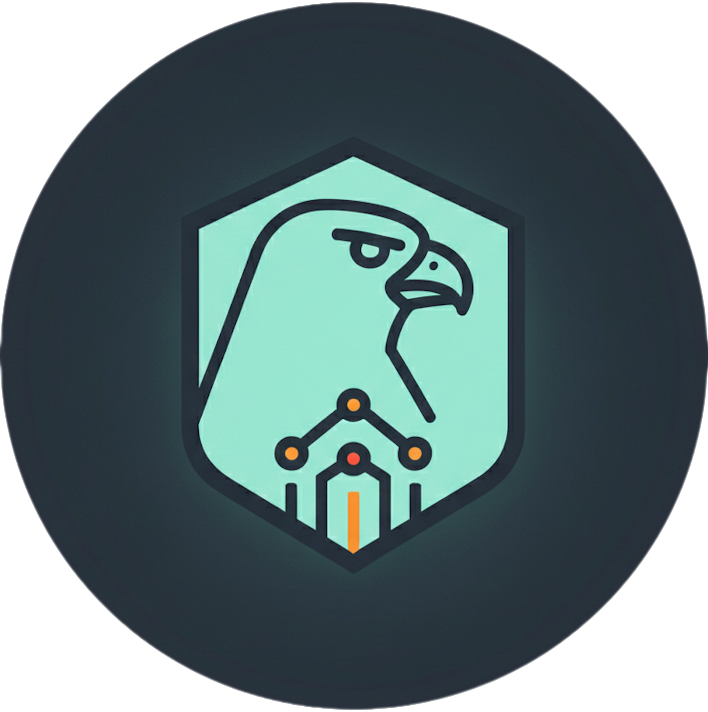

# Sentinel & Scout ML

<p align="center">
  
</p>

Real-time fraud detection API. Machine Learning Engineering project oriented to production.

---

## Table of contents

- [Prerequisites](#prerequisites)
- [Quick start](#quick-start)
- [Running with Docker](#running-with-docker)
- [Running without Docker](#running-without-docker)
- [Testing](#testing)
- [API documentation](#api-documentation)
- [Redis (feature cache)](#redis-feature-cache)

---

## Prerequisites

- **Python 3.11+**
- **[uv](https://docs.astral.sh/uv/)** (recommended) or pip
- **Docker** and **Docker Compose** (optional, for running the full stack)

---

## Quick start

With Docker (API + Redis):

```bash
docker-compose up --build
```

Without Docker (API only):

```bash
uv sync
uv run uvicorn app.main:app --reload
```

- API: [http://localhost:8000](http://localhost:8000)
- Docs: [http://localhost:8000/docs](http://localhost:8000/docs)

---

## Running with Docker

Start all services (API + Redis):

```bash
docker-compose up --build
```

The API is available at [http://localhost:8000](http://localhost:8000).

---

## Running without Docker

1. Install dependencies with [uv](https://docs.astral.sh/uv/):

   ```bash
   uv sync
   ```

2. Run the API:

   ```bash
   uv run uvicorn app.main:app --reload
   ```

   Or with host/port:

   ```bash
   uv run uvicorn app.main:app --host 0.0.0.0 --port 8000 --reload
   ```

---

## Testing

```bash
uv run pytest -v
```

Dependencies (pytest, httpx) are included in the project; no extra install needed after `uv sync`.

---

## API documentation

FastAPI serves interactive docs (Swagger UI) at:

**[http://localhost:8000/docs](http://localhost:8000/docs)**

From there you can:

- Inspect available endpoints
- Execute requests
- Validate request and response schemas

---

## Redis (feature cache)

When running with Docker, Redis is used as a feature cache.

**Attach to the Redis container:**

```bash
docker exec -it sentinel-ml-redis-1 redis-cli
```

**Inside the Redis CLI:**

- List keys:

  ```bash
  KEYS *
  ```

- Get a value (example key `tx_count:generic-k`):

  ```bash
  GET tx_count:generic-k
  ```

This lets you verify real-time feature updates, TTL behavior, and feature enrichment in the hot path.
